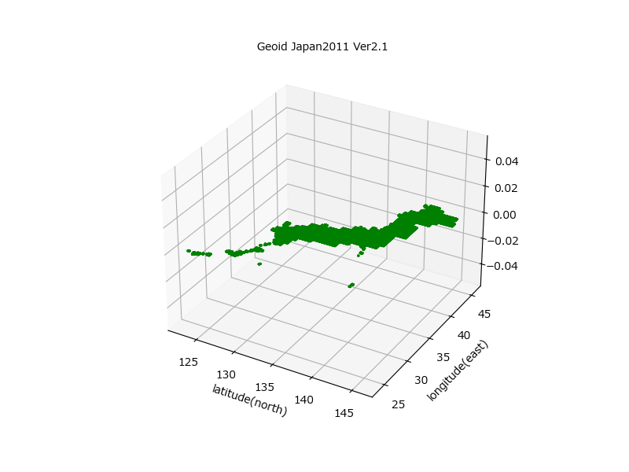
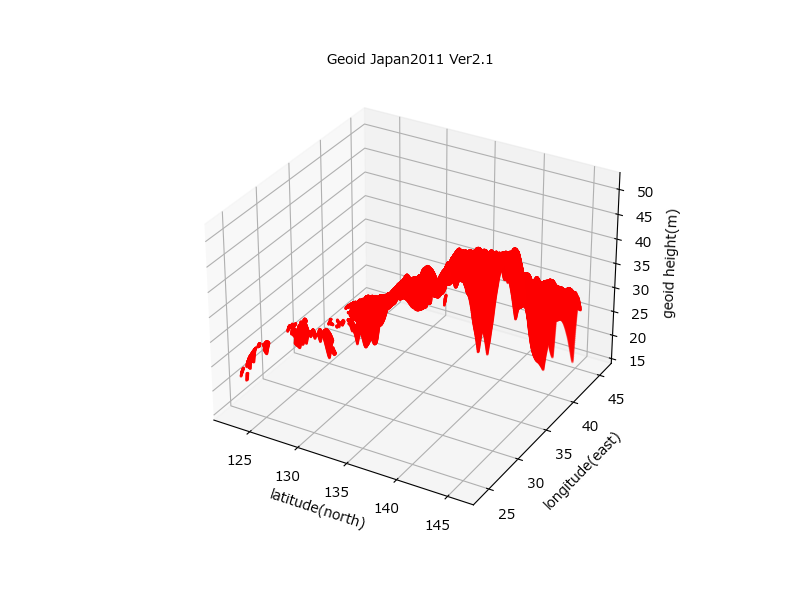

# 日本のジオイド2011 ジオイドモデル ユーティリティ

国土地理院公開のジオイドデータである
「[日本のジオイド2011(Ver.2.1) (GSIGEO2011(Ver.2.1))](https://www.gsi.go.jp/buturisokuchi/grageo_geoidseika.html)」 
をPython上で使用するためのユーティリティモジュールを提供する。

- ASCII版 日本のジオイド2011(Ver.2.1)を読み込む
- 緯度・経度からジオイド高を算出する
- 緯度・経度・ジオイド高 形式のCSVファイルを生成する

## 使い方

> 基盤地図情報ダウンロードサイトを活用するには、事前にログイン登録が必要となる。

1. [基盤地図情報ダウンロードサービス](https://fgd.gsi.go.jp/download/menu.php) をブラウザで開く。
2. 基盤地図情報ジオイドモデル「ファイル選択へ」を押下。
3. 「ASCII形式のデータのダウンロード」の「gsigeo2011_ver2_1_asc.zip [1,501KB]」（要ログイン）
4. ダウンロードファイル「gsigeo2011_ver2_1_asc.zip」を展開する。
5. `program` ディレクトリのファイル `gsigeo2011_ver2_1.asc` を `geoid.py` と同じディレクトリへ格納する。

## テスト

`gioid.py` の単体テストを実行する場合は、以下のコマンドを実行する。

```bash
pip install pytest
pytest
```

また、`python gioid.py` を実行することで、平面散布図、3次元散布図、CSVファイルを生成することができる。

 

 

> `python app.py` を実行し `http://127.0.0.1/5000` を開くことでブラウザから平面散布図を参照できる。またPOSTメソッドでWeb API `/height` を使うことで、指定した緯度・経度からジオイド高を取得できる。

## ユーティリティクラス使用例

```python
# ユーティリティモジュールのインポート
from geoid import HeightMagager

# ASCII版 日本のジオイド2011(Ver.2.1)を読み込む
mgr = HeightManager('gsigeo2011_ver2_1.asc')

# 緯度(北緯、単位：度)・経度（西経、単位：度）からジオイド高(m)を算出する
height = mgr.interpolate(26.633333, 127.966667)

# 緯度・経度・ジオイド高 形式のCSVファイルを生成する
mgr.save('geoid2011_v2.1_xyz.csv')
```

> 詳細な使い方は、[`geoid.py`](./geoid.py) のコメントを参照のこと。

## ライセンス

[MITライセンス](./LICENSE) 準拠とする。
